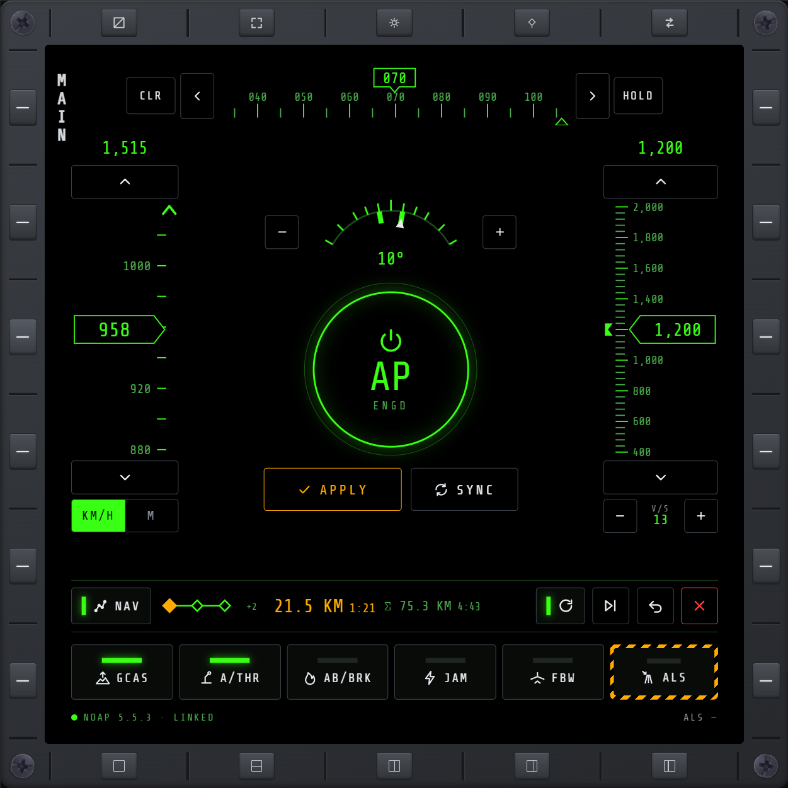
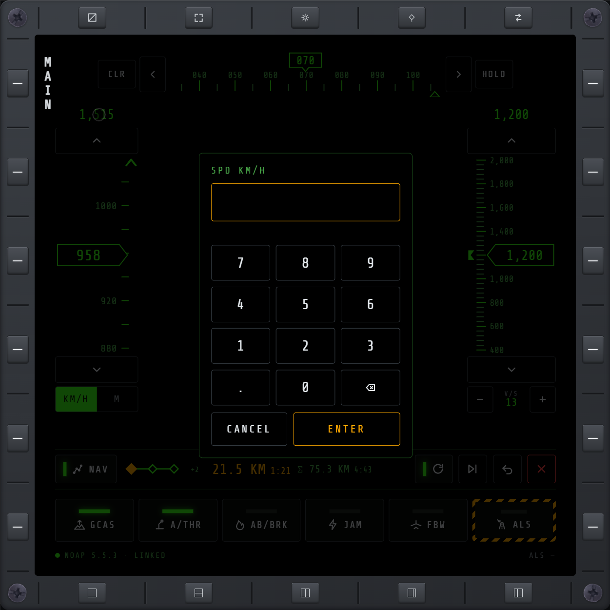

# NOXMFD Extension: NOAutopilot

[](https://github.com/roke77/NOXMFD)

[](LICENSE)

Adds an **AP** page under [NOXMFD](https://github.com/roke77/NOXMFD)'s EXT nav that shows and
controls the [NOAutopilot](https://github.com/qwerty1423/no-autopilot-mod) mod from the MFD
instead of its in-game F8 window. Requested in
[roke77/NOXMFD#86](https://github.com/roke77/NOXMFD/issues/86).



Tapping the speed or altitude target opens a keypad:



The project has two phases:

- **Phase 1 — AP page (released)**: a visible UI for NOAutopilot's existing features. Speed,
  altitude and heading tapes with their targets, the bank limit and V/S limit, APPLY/SYNC and the
  AP ring, NOAutopilot's own nav mode, and the GCAS, autothrottle, auto-jammer, autoland,
  afterburner/airbrake, and single-player FBW toggles, matching everything in NOAutopilot's F8
  window. Click/touch only; NOAutopilot's own keybinds stay as they are.
- **Phase 2 — NOXMFD integration (next)**: flying NOXMFD's WPT route (with direct-to and loop), and
  drawing NOAutopilot's own nav queue on NOXMFD's MAP.

Built entirely through NOXMFD's public extension API (see NOXMFD's
[`EXTENSIONS.md`](https://github.com/roke77/NOXMFD/blob/main/EXTENSIONS.md)). This repo does
**not** modify NOXMFD's or NOAutopilot's source. NOAutopilot is optional at runtime: without it,
the page loads and says why it's inactive.

## Status

Phase 1 (the AP page) is released as 0.1.0: it shows NOAutopilot's state and every control
works. Phase 2 (NOXMFD integration) is next. See
[`docs/noautopilot-plan.md`](docs/noautopilot-plan.md) for the design, the integration surface, and
the phasing.

## What's here

- `src/plugin/Plugin.cs` registers the page as **AUTO PILOT** in the EXT nav and publishes NOAutopilot's state at 10 Hz.
- `src/plugin/NoApBridge.cs` reads and writes NOAutopilot by reflection and builds the published
  slice.
- `src/plugin/NoApCommands.cs` validates the page's commands and applies them the way NOAutopilot's
  F8 window and keybinds do.
- `src/plugin/NoApPageAssets.cs` serves the embedded `src/web/` files.
- `src/web/noap.{html,css,js}` is the page; `noap-format.js` holds its unit, sentinel, tape, and
  target-step helpers, checked by `node src/web/noap-format.test.js`.
- `tools/preview.py` previews the page in a browser without the game (see Previewing).
- `lib/NOXMFD.dll` is a compile-time reference only (`Private=false`), not shipped.

## Building

Requires a local Nuclear Option install with BepInEx 5 and NOXMFD. If the game isn't at the default
Steam path, create a gitignored `GameDir.props` next to the `.csproj`:

```xml
<Project><PropertyGroup>
  <GameDir>D:\SteamLibrary\steamapps\common\Nuclear Option</GameDir>
</PropertyGroup></Project>
```

Then:

```bash
dotnet build NOAutopilotModule.csproj -c Release
```

The build copies `NOXMFD.NOAutopilotModule.dll` into `$(GameDir)\BepInEx\plugins\`.

## Requirements

- BepInEx 5
- [NOXMFD](https://github.com/roke77/NOXMFD) 0.58.0 or newer (extension API version 7)
- [NOAutopilot](https://github.com/qwerty1423/no-autopilot-mod) for the page to do anything

Some multiplayer hosts prohibit NOAutopilot. Check with the host before using it, especially in PvP.

## Installing

1. Install BepInEx 5, [NOXMFD](https://github.com/roke77/NOXMFD), and
   [NOAutopilot](https://github.com/qwerty1423/no-autopilot-mod).
2. Drop `NOXMFD.NOAutopilotModule.dll` into `BepInEx/plugins/`.
3. Launch the game. An **AUTO PILOT** entry appears under NOXMFD's EXT nav.

## Previewing

`tools/preview.py` serves the page with mock telemetry and a rough simulation of NOAutopilot's
responses, so layout and controls can be checked in a browser without starting the game. It reads
NOXMFD's shared assets from a sibling `../NOXMFD` checkout, or from a path given as the second
argument:

```bash
python tools/preview.py 8790
```

Then open `http://localhost:8790/`. `GET /scenario?s=<name>&metric=0|1` switches the mock state
(`flying`, `mach`, `gcas-warn`, `pull-up`, `idle`, `noair`, `missing`, `incompatible`, `broken`,
`nomission`), and `GET /commands` lists the commands the page sent.
