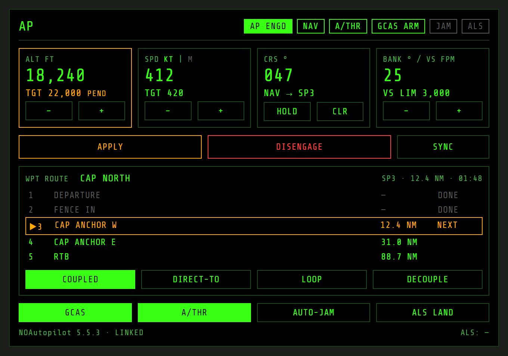

# NOAutopilot MFD — planning

## Status

Planning. Nothing is built yet. NOXMFD's side of the integration shipped in
[NOXMFD 0.58.0](https://github.com/roke77/NOXMFD/releases/tag/0.58.0) (extension API version 7:
the WPT route reads and `SetActiveRouteNextIndex`, see NOXMFD's `docs/extensions-api.md`
section 8). Everything else in this plan lives in this repo and needs no further NOXMFD core
change. This plan was checked against NOAutopilot 5.5.3.

## Source ticket

Player-submitted, [roke77/NOXMFD#86](https://github.com/roke77/NOXMFD/issues/86): add autopilot
functions to NOXMFD, or make it talk to
[NOAutopilot](https://github.com/qwerty1423/no-autopilot-mod). The same thread's request for
speed/altitude/heading in the TGT list is tracked separately as
[roke77/NOXMFD#88](https://github.com/roke77/NOXMFD/issues/88) and is out of scope here.

## NOAutopilot at a glance

A client-side BepInEx autopilot mod (MIT, `com.qwerty1423.NOAutopilot`). It works in multiplayer,
but some hosts prohibit it (GrayWar, Tomo's Co-Op/PvP at the time of writing), so this extension
treats it as optional. Its controls are keybinds plus an IMGUI **F8** window drawn on the main game
screen, which is awkward in VR or a sim pit. That is the main reason to put it on an MFD.

| Feature | What it does |
|---|---|
| Autopilot | Altitude hold, climb/descent to a target at a rate limit, wing leveller, bank-angle hold, course hold. Per-aircraft PID profiles. Stick input past a threshold disengages it. |
| Autothrottle | Speed hold in the game's units or Mach. |
| Nav mode | Flies a queue of map waypoints (right-click on the map). |
| ALS | Autoland, using the AI landing logic. Planes only. |
| Auto-GCAS | Warns, then pulls up before ground impact. On by default. |
| Auto-jammer | Fires selected jammer pods whenever the capacitor is full and a target is selected. |
| Fuel time/range | HUD readout. |
| Extras | HUD AP readout, minimap resize/zoom, single-player FBW disabler, saved map position. |

## Integration surface

NOAutopilot has no API for other mods. Its live state is one public static class,
`NOAutopilot.Core.APData`, plus a few public static methods on `NOAutopilot.Core.Plugin`. The
extension reaches them by reflection, so there is no compile-time dependency on NOAutopilot and
the extension still loads when it's absent or has changed shape.

| Need | NOAutopilot member | Access |
|---|---|---|
| Engaged | `APData.Enabled` | read/write |
| Targets | `APData.TargetAlt` (m, `-1` = off), `TargetSpeed` (m/s or Mach, `-1` = off), `TargetCourse` (deg, `-1` = off), `TargetRoll` (deg, `-999` = off), `CurrentMaxClimbRate` (m/s) | read/write |
| Speed unit | `APData.SpeedHoldIsMach` | read/write |
| Apply typed targets | `APData.UseSetValues = true` alongside `Enabled = true` | write |
| Nav | `APData.NavEnabled`, `APData.NavQueue` (`List<Vector3>`, global coordinates) | read/write |
| GCAS | `APData.GCASEnabled`, `GCASWarning`, `GCASActive` | read, write `GCASEnabled` |
| Auto-jammer | `APData.AutoJammerActive` | read/write |
| ALS | `APData.ALSActive`, `ALSStatusText` | read |
| Start autoland | `Plugin.StartAutoland()` | **private**, reflection only |
| Refresh F8 window and map markers | `Plugin.SyncMenuValues()`, `Plugin.RefreshNavVisuals()` | public static |
| Current state | `APData.CurrentAlt`, `CurrentRoll`, `PlayerRB`, `LocalAircraft` | read |
| Broken flag | `Plugin.IsBroken` | read |

Two NOAutopilot behaviors shape the design:

- **Engaging has side effects.** Its engage paths (key and F8 button) fill in a missing altitude
  target with the current altitude and a default bank limit when nav or course hold is on. Its
  disengage paths optionally clear nav and autothrottle (config-dependent). The extension copies
  the F8 button's logic rather than only flipping `Enabled`.
- **Its waypoint sequencing doesn't match NOXMFD's.** NOAutopilot pops `NavQueue[0]` within
  2,500 m, or when the point is behind the aircraft and within 10 km (`NavReachDistance`/
  `NavPassedDistance`). With "Cycle wp" on (the default), it re-appends the reached point to the
  end of the queue. NOXMFD advances at 1,000 m. See decision 3.

## Prototype mockup

An early prototype of the page, in NOXMFD's own theme (HUD green, amber for pending/selected,
Share Tech Mono). Values are illustrative.

Top to bottom:

1. **Annunciator strip.** AP ENGD, NAV, A/THR, GCAS, JAM, ALS. GCAS steps through `GCAS ARM`
   (green, `GCASEnabled`), amber on `GCASWarning`, and red `PULL UP` on `GCASActive`.
2. **Target tiles.** ALT, SPD (KT/M toggle), CRS (HOLD/CLR), and BANK with the VS limit. Each shows
   the current value large and the target below. −/+ (or tapping the value for a keypad) edits a
   pending target, shown in amber.
3. **APPLY / DISENGAGE / SYNC.** APPLY commits all pending targets at once, like the F8 window's
   Apply, so stepping altitude doesn't jerk the aircraft on every tap. SYNC loads current
   altitude, speed and course into the pending targets.
4. **WPT route panel.** The active route from NOXMFD, with completed waypoints dimmed and the next
   one highlighted. COUPLE/DECOUPLE, DIRECT-TO, LOOP.
5. **System toggles.** GCAS, A/THR, AUTO-JAM, ALS LAND (two-tap confirm), and the ALS status text.
6. **Footer.** NOAutopilot version and link state: `LINKED`, `NOT INSTALLED`, or `INCOMPATIBLE`.

## Route coupling

NOXMFD's WPT route is the source of truth. `NavQueue` is a copy of it that the extension keeps in
sync.

- **Couple**: build `NavQueue` from `Points[NextIndex..]` of `Api.GetActiveRoute()` (or the single
  `Api.GetActiveSteerPoint()` when no route is active), set `NavEnabled = true`, then call
  `RefreshNavVisuals()` so NOAutopilot's own map markers match.
- **Re-sync**: whenever `Api.RouteRevision` changes (a WPT edit, route switch, or proximity
  advance), rebuild the queue the same way.
- **Advance mirroring**: when `NavQueue[0]` stops matching the expected `Points[NextIndex]`,
  NOAutopilot has reached it first. The extension calls `Api.SetActiveRouteNextIndex(NextIndex + 1)`,
  which bumps `RouteRevision` and triggers a normal re-sync. Comparing the head point rather than
  the queue length also handles "Cycle wp" re-appending.
- **Direct-to**: `SetActiveRouteNextIndex(i)`, then the re-sync does the rest. The HUD waypoint cue
  and WPT page follow automatically.
- **Loop**: when NOXMFD reports the route complete (`NextIndex == Points.Length`) with LOOP on,
  `SetActiveRouteNextIndex(0)`.
- **Decouple**: clear `NavQueue`, set `NavEnabled = false`, and leave NOXMFD's route alone.
- **Altitude**: NOXMFD waypoints have no altitude. Queue points take the current target altitude
  (`TargetAlt`, or current altitude if none), and nav steers laterally only.
- **Map edits**: while coupled, a right-click waypoint on NOAutopilot's map is overwritten on the
  next re-sync. The page shows this (decision 3).

## Architecture

- **One BepInEx plugin**: `[BepInDependency("com.roque.NOXMFD", MinimumVersion = "0.58.0")]`
  (hard) and `[BepInDependency("com.qwerty1423.NOAutopilot", BepInDependency.DependencyFlags.SoftDependency)]`
  (soft, for load order only).
- **`NoApBridge`**: resolves `APData`/`Plugin` members once, by reflection, on first use. Every
  lookup that fails is logged with the member name and puts the bridge in `INCOMPATIBLE` rather
  than throwing. It also reads `Plugin.IsBroken`.
- **Main thread only.** State publishing runs from `Update()`, and commands arrive through the
  extension command handler, which NOXMFD already runs on the main thread. Nothing touches
  `APData` from the HTTP worker.
- **Telemetry**: `Api.PublishSlice("noap", json)` at NOXMFD's 10 Hz frame rate. The payload
  carries link state, annunciators, current/target values, coupling state, and the route snapshot
  with its revision.
- **Commands**: one flat JSON envelope `{cmd, …}` posted to `/ext/noap/command` (`apply`,
  `engage`, `disengage`, `sync`, `toggle`, `couple`, `decouple`, `direct-to`, `loop`, `als`). The
  handler validates every value at this trust boundary (finite numbers, sane ranges, known
  commands) before writing anything to `APData`.
- **Page**: `src/web/noap.{html,css,js}`, embedded in the DLL, reusing NOXMFD's
  `/assets/shared/theme.css` and `font.css`. Units follow the game's metric/imperial setting,
  like NOAutopilot's own UI.

## Recommended phasing

### Phase 1 — read-only status

The plugin skeleton, `NoApBridge` in read-only mode, the published slice, and the page showing the
annunciator strip, current/target values, and link state. This proves reflection against the live
game with no way to affect the aircraft.

### Phase 2 — controls

Target tiles with pending/APPLY, engage/disengage with the F8 window's side effects, SYNC, the KT/M
toggle, and the GCAS/A/THR/AUTO-JAM toggles. ALS LAND through the private `StartAutoland` with a
two-tap confirm.

### Phase 3 — route coupling

COUPLE/DECOUPLE, re-sync on `RouteRevision`, advance mirroring, DIRECT-TO, and LOOP, as described in
[Route coupling](#route-coupling). Needs NOXMFD 0.58.0.

## Design decisions

1. **Extension, not NOXMFD core.** NOXMFD stays free of integration-specific code, like the ATC and
   TAC extensions. The only core change was the generic route API, which any autopilot or
   navigation extension can use.
2. **Reflection, no compile-time reference.** NOAutopilot is optional, often banned by hosts, and
   its author calls the code due for a rewrite. Reflection with a logged `INCOMPATIBLE` state keeps
   NOXMFD and the page working when NOAutopilot is missing or changes.
3. **NOXMFD owns route progress.** Two independent sequencers would drift apart (2,500 m/passed
   versus 1,000 m, plus "Cycle wp"). NOXMFD's `RouteStore` stays the single authority, and the
   extension turns NOAutopilot's pops into `SetActiveRouteNextIndex` calls. LOOP is the
   extension's, not NOAutopilot's "Cycle wp".
4. **Click/touch only.** No new keybinds. NOAutopilot already has its own, and they keep working
   alongside the page.
5. **Apply-to-commit.** Target edits are pending until APPLY, matching the F8 window and keeping
   aircraft response predictable.
6. **Setup stays in F1.** PID tuning, minimap settings, and the FBW disabler are configuration, not
   in-flight controls, and stay in BepInEx's ConfigurationManager.
7. **No fuel page here.** Fuel time/range doesn't depend on NOAutopilot. If it's wanted, it
   belongs in NOXMFD itself as a separate ticket.

## Open questions

- Ask NOAutopilot's author (qwerty1423) for a small stable API, such as public `Engage`/`Apply`/
  `StartAutoland` methods, instead of relying on reflection into `APData` and a private method?
- Should the page also run while NOAutopilot's F8 window is open, or show a notice that both can
  edit the same targets?
- Should COUPLE turn off NOAutopilot's "Cycle wp" for the session, or leave the player's config as
  it is?
- Multiplayer: should the page show a warning banner in multiplayer sessions, given some hosts
  prohibit NOAutopilot?

## Out of scope

- TGT-list speed/altitude/heading (roke77/NOXMFD#88).
- Terrain following, auto take-off, helicopter-specific tuning (not NOAutopilot features either).
- Any change to NOAutopilot's source.
