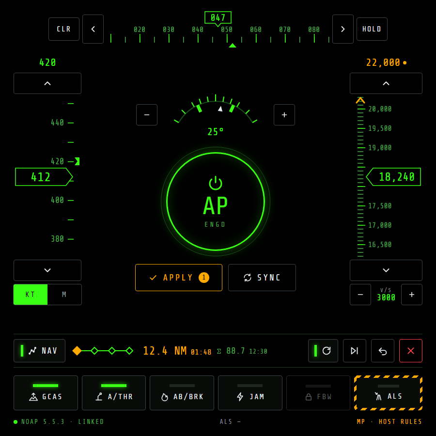

# NOAutopilot MFD — planning

## Status

Phase 1 is complete and released as 0.1.0; both build steps passed their live-game checks.
Phase 2 is next. The project runs in two phases:

- **Phase 1 — AP page.** A full MFD page that gives a visible UI to NOAutopilot's existing
  features: status, targets, engage/disengage, its own nav mode, GCAS, autothrottle, auto-jammer,
  and autoland. Nothing from NOXMFD's MAP or WPT is fed to the autopilot.
- **Phase 2 — NOXMFD integration.** Couple the autopilot to NOXMFD features, starting with flying
  NOXMFD's WPT route.

NOXMFD's side of Phase 2 already shipped in
[NOXMFD 0.58.0](https://github.com/roke77/NOXMFD/releases/tag/0.58.0) (extension API version 7:
the WPT route reads and `SetActiveRouteNextIndex`, see NOXMFD's `docs/extensions-api.md`
section 8). Phase 1 needs no NOXMFD core change. This plan was checked against NOAutopilot 5.5.3.

## Source ticket

Player-submitted, [roke77/NOXMFD#86](https://github.com/roke77/NOXMFD/issues/86): add autopilot
functions to NOXMFD, or make it talk to
[NOAutopilot](https://github.com/qwerty1423/no-autopilot-mod). The same thread's request for
speed/altitude/heading in the TGT list is tracked separately as
[roke77/NOXMFD#88](https://github.com/roke77/NOXMFD/issues/88) and is out of scope here.

## NOAutopilot at a glance

A client-side BepInEx autopilot mod (MIT, `com.qwerty1423.NOAutopilot`). It works in multiplayer,
but some hosts prohibit it (GrayWar, Tomo's Co-Op/PvP at the time of writing), so this extension
treats it as optional. Its controls are keybinds plus an IMGUI **F8** window drawn on the main game
screen, which is awkward in VR or a sim pit. That is the main reason to put it on an MFD.

| Feature | What it does |
|---|---|
| Autopilot | Altitude hold, climb/descent to a target at a rate limit, wing leveller, bank-angle hold, course hold. Per-aircraft PID profiles. Stick input past a threshold disengages it. |
| Autothrottle | Speed hold in the game's units or Mach. |
| Nav mode | Flies a queue of waypoints placed by right-clicking the in-game map. |
| ALS | Autoland, using the AI landing logic. Planes only. |
| Auto-GCAS | Warns, then pulls up before ground impact. On by default. |
| Auto-jammer | Fires selected jammer pods whenever the capacitor is full and a target is selected. |
| Fuel time/range | HUD readout. |
| Extras | HUD AP readout, minimap resize/zoom, single-player FBW disabler, saved map position. |

## Integration surface

NOAutopilot has no API for other mods. Its live state is one public static class,
`NOAutopilot.Core.APData`, plus a few public static methods on `NOAutopilot.Core.Plugin`. The
extension reaches them by reflection, so there is no compile-time dependency on NOAutopilot and
the extension still loads when it's absent or has changed shape.

| Need | NOAutopilot member | Access | Phase |
|---|---|---|---|
| Engaged | `APData.Enabled` | read/write | 1 |
| Targets | `APData.TargetAlt` (m, `-1` = off), `TargetSpeed` (m/s or Mach, `-1` = off), `TargetCourse` (deg, `-1` = off), `TargetRoll` (deg, `-999` = off), `CurrentMaxClimbRate` (m/s) | read/write | 1 |
| Speed unit | `APData.SpeedHoldIsMach` | read/write | 1 |
| Apply typed targets | `APData.UseSetValues = true` alongside `Enabled = true` | write | 1 |
| Nav mode | `APData.NavEnabled`, `APData.NavQueue` (`List<Vector3>`, global coordinates) | read, write `NavEnabled`, remove entries | 1 |
| GCAS | `APData.GCASEnabled`, `GCASWarning`, `GCASActive` | read, write `GCASEnabled` | 1 |
| Auto-jammer | `APData.AutoJammerActive` | read/write | 1 |
| Afterburner/airbrake for autothrottle | `APData.AllowExtremeThrottle` (F8's `AB0`/`AB1`) | read/write | 1 |
| FBW disabler | `APData.FBWDisabled`, then `Plugin.UpdateFBWState()` (public static); single player only | read/write | 1 |
| Cycle wp | `Plugin.NavCycle` (public static `ConfigEntry<bool>`, persisted to NOAutopilot's `.cfg`) | read/write | 1 |
| Multiplayer check | `Plugin.IsMultiplayer()` (public static) | read | 1 |
| ALS | `APData.ALSActive`, `ALSStatusText` | read | 1 |
| Start autoland | `Plugin.StartAutoland()` | **private**, reflection only | 1 |
| Refresh F8 window and map markers | `Plugin.SyncMenuValues()`, `Plugin.RefreshNavVisuals()` | public static | 1 |
| Current state | `APData.CurrentAlt`, `CurrentRoll`, `PlayerRB`, `LocalAircraft` | read | 1 |
| Broken flag | `Plugin.IsBroken` | read | 1 |
| Replace the nav queue | `APData.NavQueue` | write | 2 |

Two NOAutopilot behaviors shape the design:

- **Engaging has side effects.** Its engage paths (key and F8 button) fill in a missing altitude
  target with the current altitude and a default bank limit when nav or course hold is on. Its
  disengage paths optionally clear nav and autothrottle (config-dependent). The extension copies
  the F8 button's logic rather than only flipping `Enabled`.
- **Its waypoint sequencing doesn't match NOXMFD's.** NOAutopilot pops `NavQueue[0]` within
  2,500 m, or when the point is behind the aircraft and within 10 km (`NavReachDistance`/
  `NavPassedDistance`). With "Cycle wp" on (the default), it re-appends the reached point to the
  end of the queue. NOXMFD advances at 1,000 m. This only matters in Phase 2 (decision 3).

## Page design

The page uses the **HUD tapes** design (`images/ap-page-mockup-alt-c2-hud-tapes-lit.png`, shown
under Phase 1): speed, altitude and heading tapes laid out like the in-game HUD, a large AP ring in
the centre, and every on/off control drawn as a lit pushbutton. It uses NOXMFD's own theme (HUD
green, amber for pending, red for destructive, Share Tech Mono). Values are illustrative, and it
shows a multiplayer session (FBW OFF locked, host-rules note in the footer).

The other files in `images/` are alternatives that were considered: `alt-a-glareshield` (a
real-jet autopilot panel with knobs), `alt-b-gauges` (round dials in NOXMFD's AVN style),
`alt-c-hud-tapes` (the chosen layout with outlined toggles), and the `phase1`/`phase2` tile
prototypes. The Phase 2 prototype shows the coupled WPT route controls the nav strip gains
in Phase 2 (see Open questions).

## Phase 1 — AP page

Goal: every in-flight control from NOAutopilot's F8 window and keybinds is visible and usable on
the MFD, by click or touch. The page shows only what NOAutopilot already does. It reads nothing
from NOXMFD's MAP or WPT and never writes to `NavQueue` except to remove points, as the F8 window
does.

Page layout, top to bottom:

1. **Heading tape.** Across the top, with the current heading boxed in the centre and a bug for
   the course target (green when set, amber while pending). ‹ › step the course target, HOLD holds
   the current course, and CLR clears it.
2. **Speed and altitude tapes.** Speed on the left and altitude on the right, like the HUD. Each
   boxes the current value, marks the target with a bug on the tape (a chevron at the tape's end
   when the target is off-scale), and shows the target above the tape. ▲ ▼ step a pending target,
   shown in amber with a dot; tapping the target readout, marked with a keypad icon, opens a
   keypad. KT/M sits under the speed
   tape, and the V/S limit (−/+) under the altitude tape.
3. **Centre.** A bank scale with the current roll pointer and the bank limit marked on both sides
   (−/+ edit it). Under it, the **AP ring** engages and disengages, copying the F8 button's side
   effects. Under the ring, **APPLY** commits all pending targets at once, like the F8 window's
   Apply, so stepping altitude doesn't jerk the aircraft on every tap; its badge counts the pending
   targets. **SYNC** loads current altitude, speed and course into the pending targets.
4. **Nav strip.** NOAutopilot's own waypoint queue, as placed on the in-game map: NAV on/off, one
   pip per waypoint with the next one in amber, distance and ETA to the next point, total distance
   and time, then CYCLE WP, SKIP (drop the next point), UNDO (drop the last point) and CLEAR (red),
   matching the F8 window's controls. Points are still placed on the in-game map through
   NOAutopilot itself. CYCLE WP writes NOAutopilot's own config entry, so it persists exactly as it
   does from F8.
5. **System toggles.** GCAS, A/THR, AB/BRK (let the autothrottle use afterburner and airbrake),
   JAM (auto-jammer), FBW OFF, and ALS (autoland). FBW OFF shows a lock and is disabled in
   multiplayer, where NOAutopilot refuses it. ALS and FBW OFF sit under striped guards: starting
   autoland or turning FBW off takes two taps, since either can take the aircraft out of the
   pilot's hands (dropping FBW can leave some aircraft uncontrollable). Cancelling autoland or
   turning FBW back on is a single tap.
6. **Footer.** NOAutopilot version and link state (`LINKED`, `NOT INSTALLED`, or `INCOMPATIBLE`),
   the ALS status text, and in a multiplayer session a `MP · HOST RULES` note. With NOAutopilot
   missing or incompatible, the controls are greyed out and the page says why.

Every on/off control (NAV, CYCLE WP, and the system toggles) is a lit pushbutton: a light bar that
is green when on and dark when off. The page has no separate annunciator strip; the AP ring and
the lit bars show which modes are active. GCAS's bar is green when armed (`GCASEnabled`), amber on
`GCASWarning`, and red with `PULL UP` on `GCASActive`.

The page works alongside NOAutopilot's F8 window with no lock or notice: both edit the same
`APData`, the page always shows the live values, and the page calls `SyncMenuValues()` after each
write so F8 shows the page's edits too.

Suggested build order within Phase 1:

1. **Read-only.** Plugin skeleton, `NoApBridge` in read-only mode, the published slice, and the page
   showing the tapes, mode lights, nav queue state, and link state. This proves reflection against
   the live game with no way to affect the aircraft.
2. **Controls.** Target steps with pending/APPLY, the AP ring, SYNC, KT/M, the nav strip's
   buttons and CYCLE WP, the GCAS/A/THR/AB/BRK/JAM/FBW OFF toggles, and ALS through the
   private `StartAutoland`. Steps are 500 ft / 100 m for altitude, 10 kt / 10 km/h / 0.01 Mach
   for speed, 5° for course and bank, and 500 fpm / 2.5 m/s for the V/S limit, each snapping to
   its grid first. Tapping the speed or altitude target opens a keypad in the displayed unit.

## Phase 2 — NOXMFD integration

Goal: tie the autopilot into NOXMFD's own features. Two items are planned: flying NOXMFD's WPT
route (the page's nav strip gains the WPT route view and COUPLE/DIRECT-TO/LOOP/DECOUPLE from the
Phase 2 prototype), and drawing NOAutopilot's own nav queue on NOXMFD's MAP.

### Route coupling

NOXMFD's WPT route is the source of truth. `NavQueue` is a copy of it that the extension keeps in
sync.

- **Couple**: build `NavQueue` from `Points[NextIndex..]` of `Api.GetActiveRoute()` (or the single
  `Api.GetActiveSteerPoint()` when no route is active), set `NavEnabled = true`, then call
  `RefreshNavVisuals()` so NOAutopilot's own map markers match.
- **Re-sync**: whenever `Api.RouteRevision` changes (a WPT edit, route switch, or proximity
  advance), rebuild the queue the same way.
- **Advance mirroring**: when `NavQueue[0]` stops matching the expected `Points[NextIndex]`,
  NOAutopilot has reached it first. The extension calls `Api.SetActiveRouteNextIndex(NextIndex + 1)`,
  which bumps `RouteRevision` and triggers a normal re-sync. Comparing the head point rather than
  the queue length also handles "Cycle wp" re-appending.
- **Direct-to**: `SetActiveRouteNextIndex(i)`, then the re-sync does the rest. The HUD waypoint cue
  and WPT page follow automatically.
- **Loop**: while coupled, the nav panel's CYCLE WP toggle becomes LOOP. When NOXMFD reports the
  route complete (`NextIndex == Points.Length`) with LOOP on, the extension calls
  `SetActiveRouteNextIndex(0)`. NOAutopilot's own Cycle wp is held off while coupled and restored
  to the pilot's setting on decouple and on plugin shutdown, since `Plugin.NavCycle` persists to
  NOAutopilot's config file.
- **Decouple**: clear `NavQueue`, set `NavEnabled = false`, and leave NOXMFD's route alone.
- **Altitude**: NOXMFD waypoints have no altitude. Queue points take the current target altitude
  (`TargetAlt`, or current altitude if none), and nav steers laterally only.
- **Map edits**: while coupled, a right-click waypoint on NOAutopilot's map is overwritten on the
  next re-sync. The page shows this (decision 3).

### Nav queue on NOXMFD's MAP

When not coupled, NOAutopilot flies waypoints placed on the in-game map, which NOXMFD's MAP page
doesn't show. The extension publishes the queue (points in global coordinates, next-point index,
Cycle wp) so MAP can draw it as a route line with the next point highlighted. While coupled, the
queue is the WPT route MAP already draws, so the overlay is hidden.

This needs a new NOXMFD core surface: extensions can recolor or highlight units on MAP today, but
can't draw their own points or lines. The API shape (for example
`Api.SetMapOverlay(id, points, style)`) is designed in NOXMFD when this item starts.

## Architecture

- **One BepInEx plugin**: `[BepInDependency("com.roque.NOXMFD", MinimumVersion = "0.58.0")]`
  (hard) and `[BepInDependency("com.qwerty1423.NOAutopilot", BepInDependency.DependencyFlags.SoftDependency)]`
  (soft, for load order only). Phase 1 uses only registration, telemetry, and commands, but pins
  0.58.0 from the start so Phase 2 doesn't raise the requirement.
- **`NoApBridge`**: resolves `APData`/`Plugin` members once, by reflection, on first use. Every
  lookup that fails is logged with the member name and puts the bridge in `INCOMPATIBLE` rather
  than throwing. It also reads `Plugin.IsBroken`.
- **Main thread only.** State publishing runs from `Update()`, and commands arrive through the
  extension command handler, which NOXMFD already runs on the main thread. Nothing touches
  `APData` from the HTTP worker.
- **Telemetry**: `Api.PublishSlice("noap", json)` at NOXMFD's 10 Hz frame rate. The payload
  carries link state, mode states, current/target values, nav queue state, and the multiplayer
  flag. Phase 2 adds coupling state and the route snapshot with its revision.
- **Commands**: one flat JSON envelope `{cmd, …}` posted to `/ext/noap/command`. Phase 1: `apply`,
  `engage`, `disengage`, `sync`, `toggle` (`gcas`, `athr`, `abbrk`, `jam`, `fbw`, `nav`,
  `cycle`), `nav-skip`, `nav-undo`, `nav-clear`, `als`. Phase 2 adds
  `couple`, `decouple`, `direct-to`, `loop`. The handler validates every value at this trust
  boundary (finite numbers, sane ranges, known commands) before writing anything to `APData`.
- **Page**: `src/web/noap.{html,css,js}`, embedded in the DLL, reusing NOXMFD's
  `/assets/shared/theme.css` and `font.css`. Units follow the game's metric/imperial setting,
  like NOAutopilot's own UI.

## Design decisions

1. **Extension, not NOXMFD core.** NOXMFD stays free of integration-specific code, like the ATC and
   TAC extensions. The only core change was the generic route API, which any autopilot or
   navigation extension can use.
2. **Reflection, no compile-time reference, no upstream API request.** NOAutopilot is optional,
   often banned by hosts, and its author calls the code due for a rewrite. Reflection with a logged
   `INCOMPATIBLE` state keeps NOXMFD and the page working when NOAutopilot is missing or changes.
   Reflection is the long-term approach; the extension doesn't ask NOAutopilot's author for an API.
3. **NOXMFD owns route progress (Phase 2).** Two independent sequencers would drift apart
   (2,500 m/passed versus 1,000 m, plus "Cycle wp"). NOXMFD's `RouteStore` stays the single
   authority, and the extension turns NOAutopilot's pops into `SetActiveRouteNextIndex` calls. While
   coupled, the CYCLE WP toggle drives the extension's LOOP and NOAutopilot's Cycle wp is held off,
   so there is one loop control and no two loop features fighting.
4. **Click/touch only.** No new keybinds. NOAutopilot already has its own, and they keep working
   alongside the page.
5. **Apply-to-commit.** Target edits are pending until APPLY, matching the F8 window and keeping
   aircraft response predictable.
6. **F8 parity, setup stays in F1.** Every control in the F8 window is on the page, including
   CYCLE WP, AB/BRK, and the FBW disabler. PID tuning and minimap settings are configuration, not
   in-flight controls, and stay in BepInEx's ConfigurationManager.
7. **No fuel page here.** Fuel time/range doesn't depend on NOAutopilot. If it's wanted, it
   belongs in NOXMFD itself as a separate ticket.
8. **Phase 1 is NOAutopilot-only.** The first release is a UI for features NOAutopilot already has,
   so it can ship and be tested on its own before any NOXMFD data drives the autopilot.
9. **No lock against F8.** The page and the F8 window both stay usable. Both write the same
   `APData`, so neither can hold a stale copy.
10. **Multiplayer note, not a warning.** A footer note in multiplayer sessions reminds the pilot to
    check host rules, without a banner or anything that blocks the page.
11. **HUD tapes layout.** The page reads like the in-game HUD the pilot already scans, so targets
    sit on familiar tapes instead of in separate tiles. Icons and lit pushbuttons carry the state,
    which keeps text to short labels.

## Open questions

- **Phase 2 route view in the HUD tapes layout.** The nav strip is one row high. Where the WPT
  route view and COUPLE/DIRECT-TO/LOOP/DECOUPLE fit (a taller strip, a second page, or a panel
  that replaces the tapes while coupled) is decided when Phase 2 starts.

## Out of scope

- TGT-list speed/altitude/heading (roke77/NOXMFD#88).
- Terrain following, auto take-off, helicopter-specific tuning (not NOAutopilot features either).
- Any change to NOAutopilot's source.
